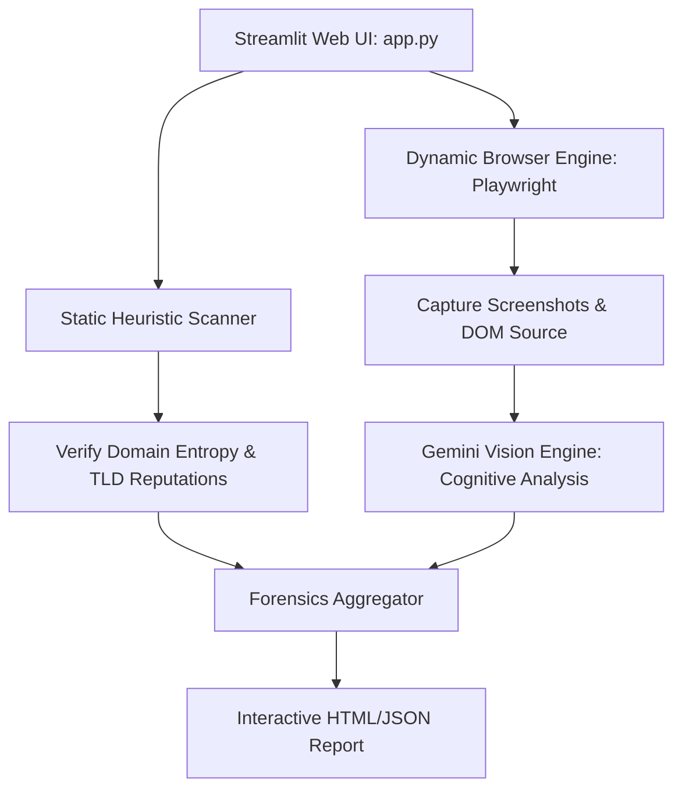

# About Phishing Forensics Engine

## Project Overview
**Phishing Forensics Engine** is a high-performance, automated cybersecurity tool designed to audit, inspect, and analyze suspicious web addresses for phishing threats, credential harvesting, and brand impersonation. 

Built using a hybrid security architecture, the engine combines **deterministic heuristic scanners**, **sandboxed browser orchestration (Playwright)**, and **cognitive visual analysis (Gemini API)** to deliver high-fidelity threat intelligence without risking user or host environments.

---

## System Architecture

The project is structured with a core inspection engine, utility layers, and a web-based interactive frontend dashboard.

### 1. Architectural Components
* **Interactive Frontend (Streamlit)**: A sleek, real-time reactive interface for security analysts to submit URLs, monitor the inspection stages (DNS lookup, headless render, visual capture, AI analysis), and read interactive reports.
* **Dynamic Inspection Sandbox (Playwright)**: Spins up an isolated headless Chromium instance to navigate to the target website, bypasses basic anti-scraping traps, extracts the raw DOM, captures response headers, and saves a pixel-perfect snapshot of the viewport.
* **Static Heuristic Scanner**: A multi-threaded scanner that evaluates static indicators such as domain age, sub-domain counts, typosquatting variants, URL entropy, presence of login fields, and secure transport (HTTPS) compliance.
* **Cognitive Visual Engine (Gemini Pro Vision)**: Analyzes the rendered screenshot to detect brand impersonation (e.g. looking like an official Microsoft or Google login page while hosted on an unrelated domain) and reads visual text cue inconsistencies.

### 2. Codebase Organization
* `app.py`: Streamlit-based web dashboard interface and lifecycle controller.
* `engine/`: Core logic packages including:
  * `parser.py`: Extracts and parses HTML forms, input elements, script tags, and resource origins.
  * `scanner.py`: Evaluates blacklists, SSL certificates, and DNS parameters.
  * `vision.py`: Integrates with the Gemini API to pass viewports for brand impersonation audits.
* `reports/`: Stores persistent JSON records of historical audits.
* `screenshots/`: Stores captured viewports in a secure sandbox.
* `verify.py`: Runs developer health checks and checks API integrations.

---

## Key Features & Design Decisions

* **Sandboxed Execution**: Headless Chromium prevents any local drive-by downloads or malicious script executions from affecting the analyst's host.
* **Double-Blind Brand Matching**: LLM vision models are prompted with zero-shot visual verification schemas to reduce false-positive rates in brand detection.
* **Rich Aesthetic UI**: Utilizes customized Streamlit theme styling with deep slate, neon red warning badges, and responsive tables to maximize operational efficiency.

---

## Roadmap & Future Enhancements
* [ ] Integrate WHOIS API to flag newly registered domains (under 14 days old).
* [ ] Add automated network traffic capture (PCAP) to track background API redirects.
* [ ] Support custom brand signatures via user-uploaded reference logos.
* [ ] Build export pathways to interface directly with SIEM platforms (Splunk, Elastic).
